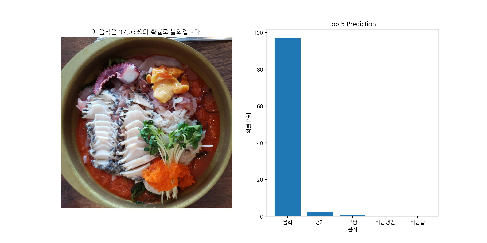

# KFCNet
Korean Food Classification Network  
한국 음식 사진들을 식별하는 네트워크를 직접 만들어보기 위해 구성한 프로젝트.  
데이터셋은 AI Hub 에서 구할 수 있으며, 해당 데이터셋 정책상 Git에는 올리지 않음.


데모 테스트
```
python -m kfcnet --mode="test"
```



## References
1. 밑바닥부터 시작하는 딥러닝 (한빛미디어, 2017), https://github.com/WegraLee/deep-learning-from-scratch
2. 데이터셋 from AIHub, https://aihub.or.kr
